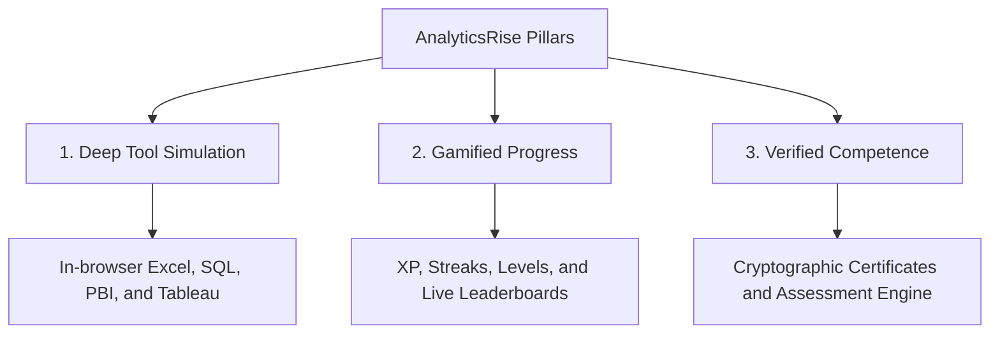

# 01. Vision and Mission

## Executive Summary
AnalyticsRise is the next-generation Data Analytics Learning Platform designed to replace passive video-watching with interactive, hands-on learning. We believe that true data analytical literacy cannot be acquired by simply listening to lectures or reading slides; it requires working inside realistic tool environments on real business challenges.

Our platform provides fully simulated, high-fidelity sandboxes for **Microsoft Excel**, **SQL databases**, **Power BI**, and **Tableau**. Through a gamified dashboard, users can track their progress, complete structured courses, run queries, model forecasts, and earn cryptographically verifiable certificates.

---

## Core Vision Statement
> "To build the world's most immersive and practical command center for data analytics training, enabling learners to transition from theory to industry-ready capability through active simulation."

---

## Mission
1. **Democratize Hands-On Practice:** Provide free, high-performance in-browser replicas of standard industry analytics tools without requiring expensive software licenses or complex installations.
2. **Shift to Problem-Based Learning:** Ground every lesson in a real-world case study—such as e-commerce transaction analysis, subscription churn forecasting, or logistics route optimization.
3. **Bridge the Skills Gap:** Align learning milestones with core job functions (e.g., building financial forecasts, writing database queries, creating reports) so graduates can prove their skills to employers immediately.
4. **Gamify Data Literacy:** Foster user engagement with interactive XP points, streaks, level-ups, and live leaderboards to make the rigor of analytical thinking exciting.

---

## Value Proposition
* **No Installations Required:** A student can write SQL SELECT statements, build Excel formulas, or configure chart dimensions instantly in their browser on any device.
* **Instant Feedback & Validation:** Automatic validation of query outputs, spreadsheet cells, and dashboard models ensures students learn from their mistakes in real-time.
* **Realistic Business Data:** Access to clean, mock operational databases simulating real customer transactions, SaaS subscriber events, and inventory logs.
* **Professional Credentials:** Cryptographically signed certificates verified by unique ledger hashes to give recruiters confidence in the student's hands-on expertise.

---

## Target Audience
1. **Career Switchers:** Individuals seeking to enter the data analytics field from non-technical backgrounds.
2. **Students & Graduates:** College graduates looking to supplement academic theory with direct technical proficiency.
3. **Upskilling Professionals:** Non-analytical professionals (e.g., marketers, product managers, sales operations) who need to master Excel or SQL to advance their careers.
4. **Enterprise Teams:** Organizations wanting an interactive onboarding program to quickly upskill non-technical staff into data-driven decision-makers.

---

## The Three Product Pillars

### Pillar 1: Deep Tool Simulation
Instead of static images or multiple-choice questions, students use sandbox simulators that replicate the standard tools they will encounter in their professional lives. The UI is designed to feel like a "Data Intelligence Command Center," providing an authentic technical workstation feeling.

### Pillar 2: Gamified Progress
By incorporating streaks, XP levels, and ranking tables, we transform dry technical learning into a habit-forming routine. A telemetry bar updates live to give immediate reinforcement of achievement.

### Pillar 3: Verified Competence
We validate actual student inputs (the formulas they write, the SQL queries they run, the visual components they connect). Earning a certificate requires passing timed assessments that verify the user can solve real-world problems.
