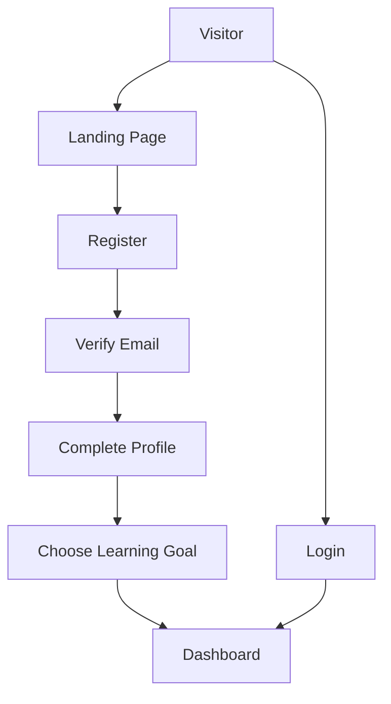

# Authentication Flow

## Steps
1. **Visitor** lands on the public landing page.
2. **Register** collects user details, creates a Firebase Auth user, and a Firestore profile.
3. **Email Verification** – user receives a verification email; UI polls for verification status.
4. **Complete Profile** – additional onboarding information is saved to Firestore.
5. **Goal Selection** – a career goal is chosen, generating a personalized roadmap stored under `roadmaps/{uid}`.
6. **Dashboard** – protected route shows user’s telemetry, roadmap, and learning dashboard.

All pages use the ARDS design system with glass‑morphism panels, neon glows, and WCAG AA compliance.
