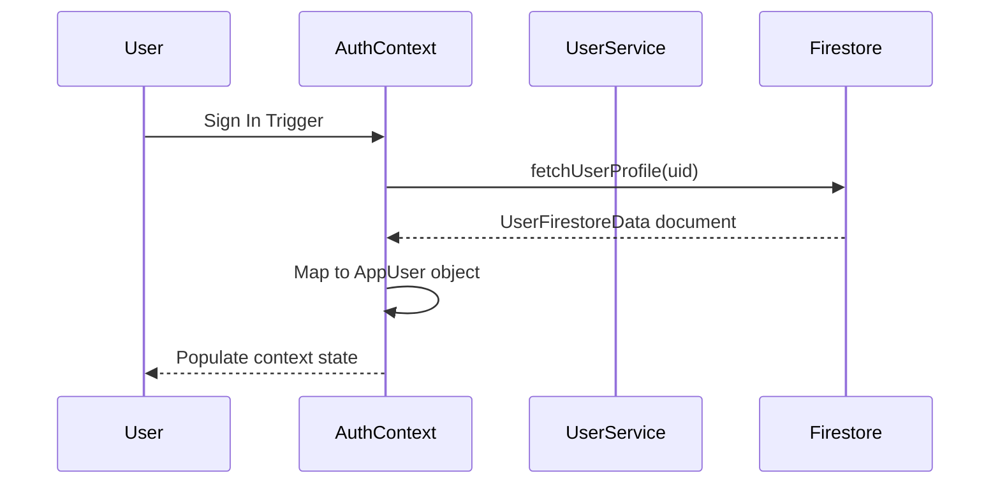

# ARCC Dashboard Data Flow

This document details the serialization, database sync pathways, and state flows of telemetry variables inside the **AnalyticsRise Command Center (ARCC)**.

---

## 1. Authentication & Profile Synchronization

When a user signs in, the auth state watcher in `AuthContext` executes:

1. **Retrieval**: `UserService.getUserProfile(uid)` pulls profile parameters and telemetry scores.
2. **Flattening**: The `AuthContext` flattens the nested Firestore `profile` and `telemetry` blocks into a single convenient `User` object.
3. **Distribution**: Components access this object through the `useAuth()` hook.

---

## 2. Interactive Writes (Career Goal & Language Selector)

When a user modifies preferred values on the dashboard:

1. **Trigger**: Clicking on a career goal (e.g. Data Scientist) or selecting a locale.
2. **Mutation**: Calls `UserService.updateUserProfile(uid, { 'profile.careerGoal': goal })`.
3. **Database Write**: Firestore document is updated.
4. **Reactive Sync**: The auth observer recaptures the transition, re-syncs state, and re-renders the roadmap flow dynamically.

---

## 3. Telemetry Schema Mapping

* **XP Points:** read from `telemetry.xp`
* **Study Streak:** read from `telemetry.streak`
* **Career Goal:** read from `profile.careerGoal`
* **Language Selection:** read from `profile.preferredLanguage`
* **Skills Profile:** read from `telemetry.skills` (fallbacks back to defaults if uninitialized)
